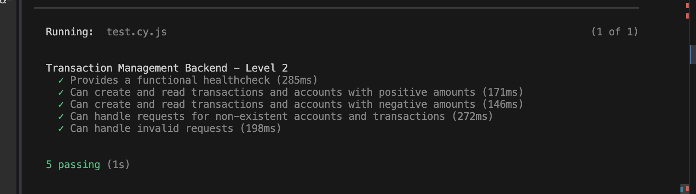

## Create DB
```
touch database/database.sqlite
php artisan migrate
```

# installations
- Swagger Installation
```
composer require darkaonline/l5-swagger
php artisan vendor:publish --provider "L5Swagger\L5SwaggerServiceProvider"
```
- in config\app.php add following line:
```
 'providers' => [
    ...,
    L5Swagger\L5SwaggerServiceProvider::class,
 ]
```
- in config\l5-swagger.php change following line:
```
            'L5_SWAGGER_CONST_HOST' => env('L5_SWAGGER_CONST_HOST', 'http://127.0.0.1:8000'),
```
- Then run add swagger annotations to any controller, then run: 
```
php artisan l5-swagger:generate
```

#NB:
- Every time you change the Swagger annotations, run the following command to publish the changea:
```
php artisan l5-swagger:generate
```

## Controllers
- Admin
```
php artisan make:controller TransactionController

```
- API
```
php artisan make:controller API/TransactionAPIController
php artisan make:controller API/AccountAPIController
```

## Models
```
php artisan make:model Transaction -m     
php artisan make:model Account -m     
```

## clear machine cache:
- in the terminal, run commands:
```
php artisan optimize:clear
php artisan config:clear
php artisan route:clear
php artisan route:cache
php artisan config:cache
php artisan cache:clear
composer dump-autoload
php artisan view:clear
```

# Swagger documentation
- http://127.0.0.1:8000/api/documentation


# Running nmp tests
- install npm via : npm install
```
npm run test
```
- results:
Test results        
:-------------------------:
 

# creating PhpUnit tests
```
php artisan make:test TransactionTest
```
# Running PhpUnit tests
```
 ./vendor/bin/phpunit
 ```